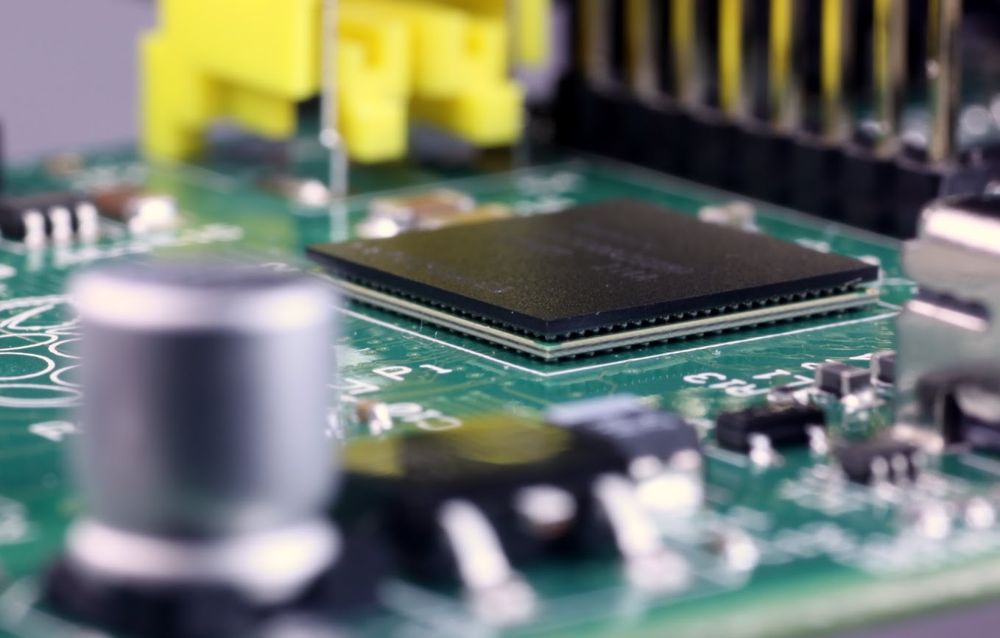

# Orígenes

Se trata de crear un sistema barato capaz de permitir enseñar a los niños (y a adultos) a programar.

* En 2005, la Universidad de Cambridge notó como cada vez menos estudiantes quería estudiar informática

* Pensaron que la solución podía ser un ordenador superbarato con el que pudieran jugar, aprendiendo en el camino.

Es una fundación

Utiliza un diseño avanzado

# Versiones

Versión A
Versión B

Versión 2
Versión 2+

# La llegada de los clones

BananaPi