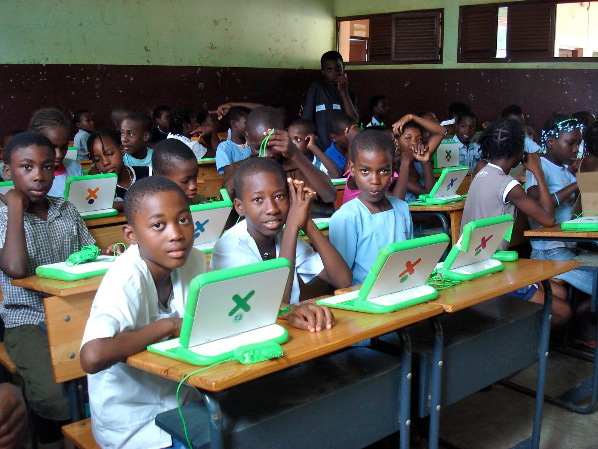

# Iniciativas similares

## [Micro micro:Bit](http://www.eldiario.es/turing/BBC_micro-bit-utilizaran-escolares-Reino-Unido_0_411209780.html)

	Llegará a todos los chavales de 11 y 12 años

	* Es similar a arduino
	* Enseña a programar
	* Enseña electrónica
	* Ampliable

[Vídeo](https://www.youtube.com/watch?time_continue=6&v=Wuza5WXiMkc)

## [One Laptop Per Child (OLPC)](http://one.laptop.org/)

## [Arduino](http://arduino.cc)