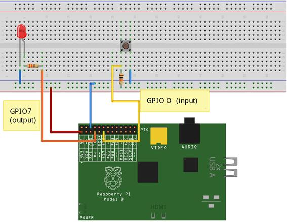
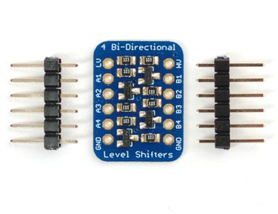

# GPIO

* Son los pines que podemos usar como salidas o como entradas, pero siempre de tipo digital.
* Utilizan 3.3V
* Podemos configurar cada uno como entrada o como salida
* Algunos de ellos se pueden usar como comunicaciones especializadas: SPI, I2C, UART

# Precauciones

* Antes de realizar cualquier tipo de conexión en los conectores o pines debemos de tener siempre la precaución de tener desconectada la alimentación de la Raspberry Pi. 
* Evitaremos derivaciones eléctricas o cortos .
* Conviene recordar que los pines de la CPU de la placa están conectados directamente a los diferentes conectores y pines, con lo que cualquier cosa que hagamos sobre los pines la estamos haciendo directamente sobre la CPU.
* También hay que tener en cuenta que los pines GPIO no soportan 5 V, sólo 3.3V y un máximo de 16 mA, por lo que hay que tomar precauciones en este sentido.

## Pines

Hay que tener cuidado con no equivocarse. Podemos usar una etiqueta

Las distinas versiones tienen algunos pines distintos

Las versiones de 40 pines

## Librerías

Hay 4 librerías GPIO

* Shell (línea de comandos)
* Rpi. GPIO
* wiringPi (Gordon Henderson wiringpi.com)
* BCM 2835

Veamos como llaman a los distintos pines

## Wiring

Para instalarlo tenemos que tener instalado parte del entorno de desarrollo de python

	sudo apt-get install python-dev python-setuptools git-core

Descargamos el código (también podíamos haber descargado el fichero zip)

	git clone git://git.drogon.net/wiringPi

La compilamos

	./build

Y ya podemos udarla 

	gpio readall

## Conectando un led

Este es el esquema para conectar un led

El montaje sería

Hagamos un programa que parpadea el led conectado 

	import time
	# Importamos la librería wiringpi
	import wiringpi2
	#Configuramos la numeración de los pines con respecto al
	#estandar de la librería wiringpi (pin de entrada salida 
	#	GPIO0)

	io = wiringpi2.GPIO(wiringpi2.GPIO.WPI_MODE_PINS)

	#Configuramos el pin 0 como salida
	io.pinMode(0,io.OUTPUT)

	# Ciclo for que ejecutamos 3 veces
	for x in range (0,3):
		io.digitalWrite(0,io.HIGH) #encendemos el led
		time.sleep(0.5) # esperamos medio segundo
		io.digitalWrite(0,io.LOW) # apagamos el led
		time.sleep(0.5) # esperamos medio segundo

Para ejecutar estos programas necesitamos permiso de administrador

	sudo python blink.py

# Conectado un pulsador

Usando el código

## Usos de los GPIOs

* Encender apagar LEDs (no podemos aspirar a encender nada de mayor potencia directamente). Estas son las salidas digitales, capaces de estar en estado alto o bajo. 
* Algunos de estos pines pueden generar PWM (modulación por ancho de pulso) protocolo que usan los servos.
* Detectar pulsaciones de botones/interruptores. Estas son las entradas digitales.
• Acceso al puerto serie por los terminales TX/TX
• Acceso al bus I2C, bus de comunicaciones usado por muchos dispositivos
• Acceso al bus SPI, bus de comunicaciones similar al I2C pero con diferentes especificaciones

El bus I2C y SPI nos permiten conectar con dispositivos externos que nos
expanden su funcionalidad. Es como si conectáramos periféricos a nuestra
Raspberry.

* También están disponibles las líneas de alimentación de 5v y 3.3v y por supuesto tierra.

* Todos los pines se pueden configurar tanto de entrada como de salida.

* Algunos de los pines tienen una segunda función como por ejemplo los etiquetados como SCL y SDA utilizados para I2C y los MOSI, MISO y SCKL utilizados para conectar con dispositivos SPI.
* Hay que tener muy claro que todos los pines usan niveles lógicos de 3.3V y no es seguro conectarlos directamente a 5V, porque las entradas han de ser menores de 3.3V. Igualmente no podemos esperar salidas superiores a 3.3V.
* En caso de querer conectar con lógica de 5v tendremos que usar una electrónica para adaptar niveles.
* Existen dispositivos convertidores de niveles (level shifters) con diferentes tecnologías. Los más antiguos están formados por unas resistencias y unos transistores.

Para identificar más fácilmente los pines podemos usar una etiqueta

## Placas GPIO

### Clobber

* Es bastante arriesgado y complicado trabajar directamente con los pines del conector GPIO de la RaspBerry.
* Existen en el mercado una gran variedad de placas que nos facilitan la vida. 
* Algunas sólo nos facilitan la conexión. 
* Otras nos proporcionan mayor funcionalidad. 
* En cualquier caso ganamos en tranquilidad al usarlas.

Son simples adaptadores que nos facilitan la vida permitiendo conectar de manera sencilla
con las placas de prototipo

### PiPlate

Se trata de una placa de prototipo especialmente adaptada al tamaño de la Raspberry y que nos permite acceder de forma sencilla a los pines por nombre y funcionalidad.

### PiFace

* Tiene un fin claramente educativo, 
* Incluye diferentes dispositivos 
* Leds que se pueden activar independientemente, 
* 2 relés para activar cargas de potencia y 
* 4 pulsadores conectados a otras tantas entradas

