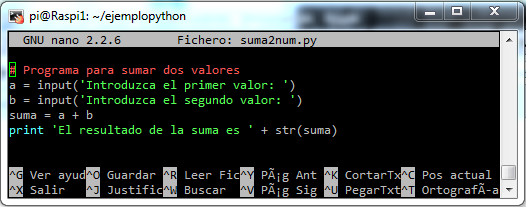
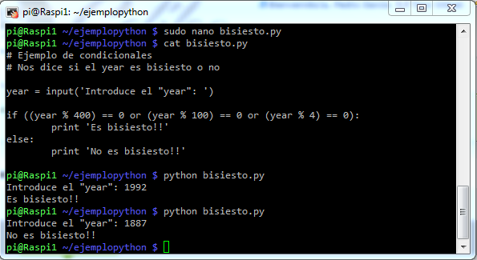

# python

Es un lenguage de gran producitividad, sencillo, potente y con millones de línea ya desarrolladas que se pueden usar directamente por medio de paquetes instalables

Se utiliza idle (o python directamente)

Veamos algunos ejemplos

* Operaciones numéricas y petición de datos al usuario

* Sentencias de control condicionales

* Sentencias de control de repetición

* Diccionarios que nos permitirán relacionar contenidos

* Veamos una implementación de un programa más elaborado como "Piedra, Papel o Tijera"

