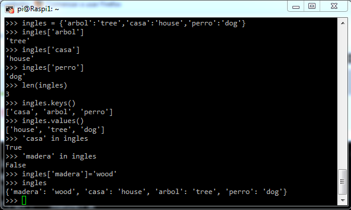
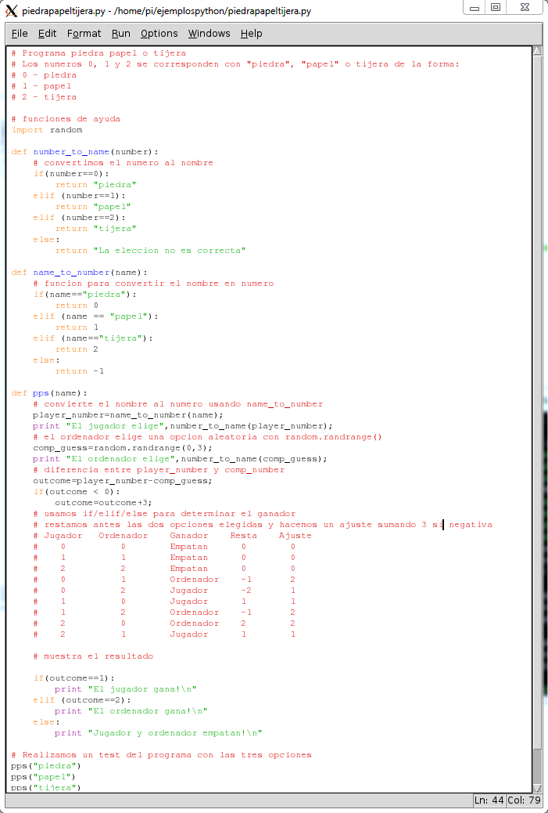

# python

Es un lenguage de gran producitividad, sencillo, potente y con millones de línea ya desarrolladas que se pueden usar directamente por medio de paquetes instalables

Se utiliza idle (o python directamente)

Veamos algunos ejemplos

* Podemos usar diccionarios que nos permitirán relacionar contenidos

* Veamos una implementación de un programa más elaborado como "Piedra, Papel o Tijera"

